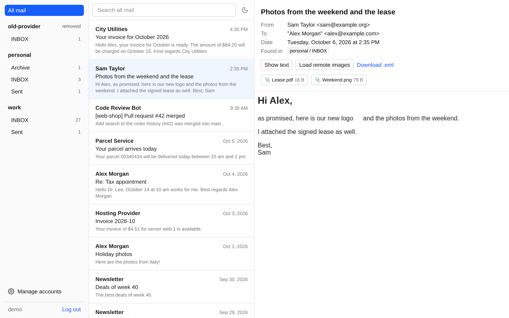

# mail-archive

> [!WARNING]
> **This project is entirely vibe-coded.** All code, configuration and
> documentation were written by an AI (Claude) under human direction, without
> line-by-line human review. Review it yourself before trusting it with
> important data, and keep independent backups of your mail.

`mail-archive` copies messages from one or more IMAP mailboxes into a single,
deduplicated archive, with full-text search and a web UI. It is a **read-only
copy**: the servers are never modified.

**Documentation: <https://pklnx.github.io/mail-archive/>**



## Features

- **Read-only.** Folders are opened with `EXAMINE` and messages are fetched with
  `BODY.PEEK[]`; not even the `\Seen` flag changes. Mail deleted on the server
  stays in the archive.
- **Many mailboxes, one archive.** Identical messages are stored once, with
  every account, folder and UID where they were found.
- **Plain files.** Raw messages are `.eml` files that any mail client opens;
  metadata lives in PostgreSQL.
- **Full-text search** over subject, sender and body, with German and English
  stemming.
- **Web UI** with login to browse, search and read mail, manage accounts and start syncs.
  Syncs also run on a schedule. Light and dark mode, German and English.
- **Docker Compose** setup with images for amd64 and arm64 (Apple Silicon).
- Works with mail.de, GMX, WEB.DE, Gmail, iCloud and any standard IMAP server.

## Quick start

```sh
git clone https://github.com/pklnx/mail-archive.git && cd mail-archive
cp .env.example .env    # set POSTGRES_PASSWORD and MAIL_ARCHIVE_SECRET_KEY
./ma migrate
./ma user add NAME --admin   # your login for the web UI
docker compose up -d web
```

Open <http://localhost:8080>, log in and add an account under **Manage
accounts**. The web UI is only reachable from your own computer; read
[Security](https://pklnx.github.io/mail-archive/reference/security) before
opening it to your network or a VPN.

More in the [getting started guide](https://pklnx.github.io/mail-archive/guide/getting-started).

## Development

See [Contributing](https://pklnx.github.io/mail-archive/development/) for
the toolchain, tests, migrations and the documentation workflow. The
documentation sources are in [`docs/`](docs/).

## License

[MIT](LICENSE)
